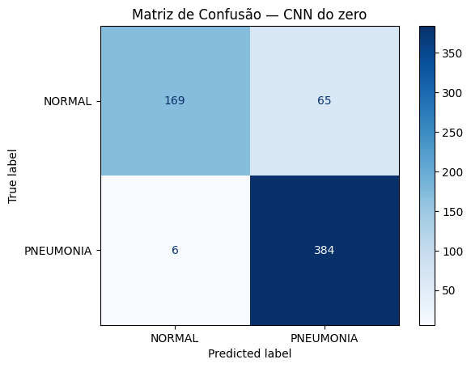
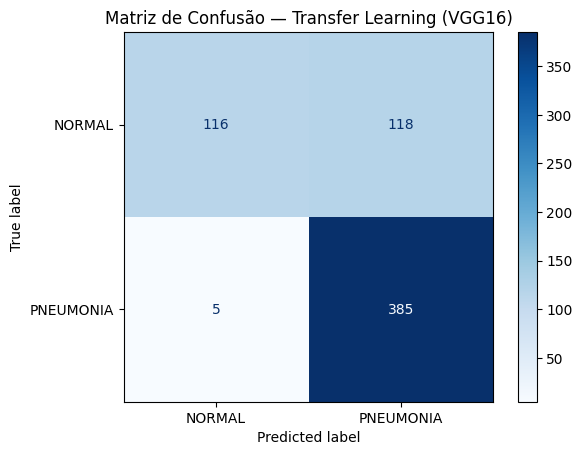
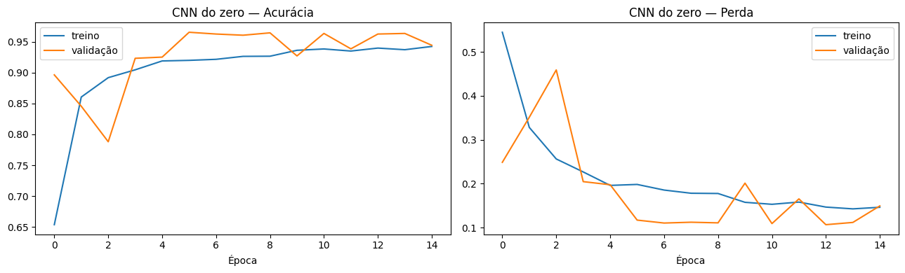

# FIAP - Faculdade de Informática e Administração Paulista

<p align="center">
<a href= "https://www.fiap.com.br/"></a>
</p>

<br>

# CardioIA — Fase 4: Assistente Cardiológico Virtual com Visão Computacional

## CardioIA

Protótipo de **Assistente Cardiológico Virtual** que aplica **Visão Computacional** à
análise de exames médicos simulados. A solução classifica radiografias de tórax
(**NORMAL** vs **PNEUMONIA**) usando Redes Neurais Convolucionais, comparando uma
**CNN treinada do zero** com **Transfer Learning (VGG16)**, e disponibiliza os
resultados em protótipos acessíveis (web Flask e app mobile React Native).

## 👨‍🎓 Integrantes:
- <a href="https://www.linkedin.com/company/inova-fusca">Alice C. M. Assis — RM566233</a>
- <a href="https://www.linkedin.com/company/inova-fusca">Leonardo S. Souza — RM563928</a>
- <a href="https://www.linkedin.com/company/inova-fusca">Lucas B. Francelino — RM561409</a>
- <a href="https://www.linkedin.com/company/inova-fusca">Pedro L. T. Silva — RM561644</a>
- <a href="https://www.linkedin.com/company/inova-fusca">Vitor A. Bezerra — RM563001</a>

## 👩‍🏫 Professores:
### Tutor(a)
- <a href="https://www.linkedin.com/company/inova-fusca">Caique Nonato da Silva Bezerra</a>
### Coordenador(a)
- <a href="https://www.linkedin.com/company/inova-fusca">André Godoi Chiovato</a>

## 📜 Descrição

A Fase 4 do **CardioIA** coloca a Visão Computacional no centro do projeto: o desafio é
transformar imagens médicas em informação clinicamente relevante, de forma eficiente,
confiável e responsável. Construímos um protótipo de **Assistente Cardiológico Virtual**
que percorre todo o ciclo de um problema real de IA em saúde — do pré-processamento das
imagens à apresentação dos resultados em uma interface acessível.

**Dataset.** Utilizamos o [Chest X-Ray Images (Pneumonia)](https://www.kaggle.com/datasets/paultimothymooney/chest-xray-pneumonia),
público no Kaggle, com **5.856 radiografias** de tórax rotuladas em NORMAL e PNEUMONIA.
A escolha é justificada por sua relevância clínica cardiopulmonar, tamanho viável (~2 GB)
para treino completo no Google Colab gratuito (ante os ~42 GB do NIH Chest X-rays
completo, sugerido no enunciado) e por seu **desbalanceamento real ~3:1**, que sustenta a
análise ética da fase.

**Parte 1 — Pré-processamento.** Implementamos um pipeline reprodutível
(`notebooks/01_preprocessamento.ipynb`): redimensionamento para **150×150**, conversão
para **RGB (3 canais)**, **normalização** dos pixels para [0, 1] e recriação dos
conjuntos de **treino/validação/teste** (o conjunto de validação original tinha apenas
16 imagens). Aplicamos **data augmentation somente no treino** (rotação, zoom e contraste
±10%, sem flip horizontal — que inverteria a anatomia cardíaca) e **pesos de classe** para
compensar o desbalanceamento. Tudo com semente fixa (`SEED=42`).

**Parte 2 — Classificação com CNN.** Em `notebooks/02_cnn_transfer_learning.ipynb`
treinamos e comparamos duas abordagens: (a) uma **CNN do zero** com 4 blocos
convolucionais; (b) **Transfer Learning com VGG16** (feature extraction + fine-tuning do
`block5`). Avaliamos no conjunto de teste (624 imagens) com **acurácia, matriz de
confusão, precisão, recall e F1-score**. A **CNN do zero** foi selecionada por apresentar
o melhor F1 macro (0,8709) e o melhor equilíbrio entre as classes; é o modelo salvo em
`modelo_cardioia.keras` e consumido pelos protótipos.

**Protótipos.** Os resultados são apresentados de três formas: célula interativa no
próprio notebook, **app web em Flask** (`app/`) com upload de imagem e, como **Ir Além 2**,
um **app mobile em React Native/Expo** (`mobile/`) integrado ao backend Flask.

**Ir Além 1 — Ética e Governança.** Analisamos limitações e vieses do dataset (fonte única
pediátrica, ausência de metadados demográficos, desbalanceamento) e aplicamos métricas de
**fairness** (Equalized Odds / Equal Opportunity, FPR/FNR, calibração), propondo mitigações
(`notebooks/03_etica_governanca.ipynb` e `relatorio/ir_alem1_etica_governanca.md`).

**Divisão de tarefas (equipe de 5 integrantes).**

| Integrante | Responsabilidade principal |
|---|---|
| Pedro L. T. Silva | Parte 1 — pré-processamento e organização das imagens |
| Alice C. M. Assis | Parte 2 — CNN do zero e Transfer Learning (VGG16) |
| Vitor A. Bezerra | Protótipo web (Flask) e interface de classificação |
| Leonardo S. Souza | Ir Além 2 — app mobile React Native (Expo) |
| Lucas B. Francelino | Ir Além 1 — ética/fairness, documentação e relatórios |

## 📁 Estrutura de pastas

Dentre os arquivos e pastas presentes na raiz do projeto, definem-se:

- <b>assets</b>: imagens do projeto — logo da FIAP e os **prints das métricas** (gráficos,
  curvas de treino e matrizes de confusão) extraídos dos notebooks.

- <b>notebooks</b>: notebooks Python (Google Colab) com todo o código de ML:
  - `01_preprocessamento.ipynb` — Parte 1: pipeline de preparação das imagens;
  - `02_cnn_transfer_learning.ipynb` — Parte 2: CNN do zero, VGG16, métricas e protótipo;
  - `03_etica_governanca.ipynb` — Ir Além 1: análise de fairness e governança.

- <b>relatorio</b>: relatórios em markdown — pré-processamento (Parte 1), modelos e
  resultados (Parte 2) e ética e governança (Ir Além 1).

- <b>app</b>: protótipo web em **Flask** (`app.py` + `templates/index.html`) que carrega o
  modelo treinado e expõe o endpoint `/predict` (com CORS para o app mobile).

- <b>mobile</b>: **Ir Além 2** — app **React Native (Expo)** que consome o backend Flask;
  veja a documentação dedicada em [`mobile/README.md`](mobile/README.md).

- <b>requirements.txt</b>: dependências Python do projeto (notebooks + Flask).

- <b>README.md</b>: arquivo que serve como guia e explicação geral sobre o projeto (o
  mesmo que você está lendo agora).

## 🔧 Como executar o código

**Pré-requisitos:** conta no [Google Colab](https://colab.research.google.com) (GPU T4
gratuita) para os notebooks; **Python 3.10+** para o backend Flask; e **Node.js 18+** com
**Expo** para o app mobile. As bibliotecas Python estão em `requirements.txt`
(TensorFlow ≥ 2.15, Flask, Pillow, scikit-learn etc.).

### Fase 1 e 2 — Notebooks (Google Colab — recomendado)

1. Faça upload dos notebooks no Google Colab;
2. Ative a GPU: `Ambiente de execução > Alterar tipo de ambiente > GPU (T4)`;
3. Execute as células em ordem. O dataset é baixado automaticamente via `kagglehub`
   (não requer credenciais);
4. Ordem: `01_preprocessamento.ipynb` → `02_cnn_transfer_learning.ipynb`;
5. Ao final do Notebook 2, o melhor modelo é salvo como `modelo_cardioia.keras` — baixe-o
   (ou copie para o Drive) para usar no protótipo Flask.

O pipeline da Parte 1 cria os conjuntos com split reprodutível e mantém o teste original
intacto:

```python
train_ds = tf.keras.utils.image_dataset_from_directory(
    DATA_DIR / "train", validation_split=0.20, subset="training",
    seed=42, image_size=(150, 150), batch_size=32, label_mode="binary")
val_ds = tf.keras.utils.image_dataset_from_directory(
    DATA_DIR / "train", validation_split=0.20, subset="validation",
    seed=42, image_size=(150, 150), batch_size=32, label_mode="binary")
test_ds = tf.keras.utils.image_dataset_from_directory(
    DATA_DIR / "test", image_size=(150, 150), batch_size=32,
    label_mode="binary", shuffle=False)  # ordem fixa p/ matriz de confusão
```

Normalização [0,1], **data augmentation só no treino** e **pesos de classe** para o
desbalanceamento ~3:1:

```python
normalization = tf.keras.layers.Rescaling(1.0 / 255)
data_augmentation = tf.keras.Sequential([
    tf.keras.layers.RandomRotation(0.10),
    tf.keras.layers.RandomZoom(0.10),
    tf.keras.layers.RandomContrast(0.10),
])  # sem flip horizontal: inverteria a anatomia cardíaca

class_weight = {0: n_total / (2.0 * n_normal),   # NORMAL (minoritária -> peso maior)
                1: n_total / (2.0 * n_pneu)}      # PNEUMONIA
```

**CNN do zero** (4 blocos convolucionais):

```python
model = tf.keras.Sequential([
    tf.keras.layers.Input(shape=(150, 150, 3)),
    tf.keras.layers.Conv2D(32, 3, activation="relu", padding="same"),
    tf.keras.layers.MaxPooling2D(),
    tf.keras.layers.Conv2D(64, 3, activation="relu", padding="same"),
    tf.keras.layers.MaxPooling2D(),
    tf.keras.layers.Conv2D(128, 3, activation="relu", padding="same"),
    tf.keras.layers.MaxPooling2D(),
    tf.keras.layers.Conv2D(128, 3, activation="relu", padding="same"),
    tf.keras.layers.MaxPooling2D(),
    tf.keras.layers.Flatten(),
    tf.keras.layers.Dropout(0.5),
    tf.keras.layers.Dense(256, activation="relu"),
    tf.keras.layers.Dense(1, activation="sigmoid"),
], name="cnn_do_zero")
```

**Transfer Learning (VGG16)** — feature extraction e depois fine-tuning do `block5`:

```python
base_vgg = VGG16(weights="imagenet", include_top=False, input_shape=(150, 150, 3))
base_vgg.trainable = False                      # Fase 1: base congelada
x = preprocess_input(inputs)
x = base_vgg(x, training=False)
x = tf.keras.layers.GlobalAveragePooling2D()(x)
x = tf.keras.layers.Dropout(0.4)(x)
x = tf.keras.layers.Dense(256, activation="relu")(x)
outputs = tf.keras.layers.Dense(1, activation="sigmoid")(x)

# Fase 2 — fine-tuning do último bloco convolucional com LR 10x menor
base_vgg.trainable = True
for layer in base_vgg.layers:
    layer.trainable = layer.name.startswith("block5")
modelo_tl.compile(optimizer=tf.keras.optimizers.Adam(1e-5), ...)
```

### Protótipo web (Flask)

```bash
pip install -r requirements.txt
# coloque modelo_cardioia.keras dentro de app/
cd app
python app.py
# acesse http://localhost:5000
```

O endpoint `/predict` replica o pré-processamento da Parte 1 e devolve classe, confiança
e o aviso educacional:

```python
@app.route("/predict", methods=["POST"])
def predict():
    arr = preparar_imagem(request.files["imagem"].read())   # RGB + resize 150x150
    prob = float(modelo.predict(arr, verbose=0).ravel()[0])
    classe = CLASS_NAMES[int(prob >= 0.5)]
    confianca = prob if prob >= 0.5 else 1 - prob
    return jsonify({"classe": classe, "confianca": round(confianca * 100, 1),
                    "aviso": "Protótipo educacional — não substitui diagnóstico médico."})
```

### App React Native (Ir Além 2 — Expo)

Protótipo em **React Native (Expo)** que consome o mesmo backend Flask e exibe a categoria
detectada pela CNN. Roda da **mesma base** de dois jeitos:

**No navegador (recomendado — local, sem celular):**

```bash
# com o backend Flask já rodando em localhost:5000:
cd mobile
npm install
npx expo start --web    # abre o app no navegador (~http://localhost:8081)
```

**No celular (Expo Go):** ajuste `mobile/src/config.js` para o IP da sua máquina e rode
`npx expo start` para escanear o QR code.

Passo a passo completo (pré-requisitos, configuração, troubleshooting e roteiro do vídeo)
em [`mobile/README.md`](mobile/README.md).

## 📊 Resultados

Métricas obtidas no conjunto de teste (624 imagens), geradas pelo
[`02_cnn_transfer_learning.ipynb`](notebooks/02_cnn_transfer_learning.ipynb):

| Modelo | Acurácia | Recall (PNEUMONIA) | Recall (NORMAL) | F1 macro |
|---|---|---|---|---|
| CNN do zero | 88,62% | 98,46% | 72,22% | **0,8709** |
| Transfer Learning (VGG16) | 80,29% | 98,72% | 49,57% | 0,7579 |

**Modelo selecionado:** `cnn_do_zero` (maior F1 macro) — é o modelo salvo em
`modelo_cardioia.keras`, consumido pelo app Flask e pelo app mobile.

**Prints das métricas — matrizes de confusão (conjunto de teste):**

| CNN do zero | Transfer Learning (VGG16) |
|---|---|
|  |  |

**Curvas de treino (acurácia e perda) — CNN do zero:**



> **Leitura dos resultados:** ambos os modelos atingiram recall de PNEUMONIA acima de
> 98% — ótimo para triagem, pois minimiza falsos negativos (casos doentes não
> identificados). Porém o VGG16 com fine-tuning teve recall de NORMAL baixo (49,57%),
> classificando muitos exames saudáveis como PNEUMONIA (falsos positivos). A CNN do
> zero apresentou o melhor equilíbrio entre as duas classes (F1 macro 0,8709) e por
> isso foi o modelo escolhido.

## 📚 Documentação complementar

A partir desta raiz, navegue para os documentos e códigos de cada entregável:

- **Parte 1 — Pré-processamento:** [`notebooks/01_preprocessamento.ipynb`](notebooks/01_preprocessamento.ipynb) · [`relatorio/parte1_relatorio.md`](relatorio/parte1_relatorio.md)
- **Parte 2 — CNN e Transfer Learning:** [`notebooks/02_cnn_transfer_learning.ipynb`](notebooks/02_cnn_transfer_learning.ipynb) · [`relatorio/parte2_relatorio.md`](relatorio/parte2_relatorio.md)
- **Ir Além 1 — Ética e Governança:** [`notebooks/03_etica_governanca.ipynb`](notebooks/03_etica_governanca.ipynb) · [`relatorio/ir_alem1_etica_governanca.md`](relatorio/ir_alem1_etica_governanca.md)
- **Ir Além 2 — App mobile:** [`mobile/README.md`](mobile/README.md)

## ✅ Mapeamento dos critérios de avaliação

| Critério | Pontos | Onde está |
|---|---|---|
| Pipeline de pré-processamento | 3 | [`notebooks/01_preprocessamento.ipynb`](notebooks/01_preprocessamento.ipynb) + [`relatorio/parte1_relatorio.md`](relatorio/parte1_relatorio.md) |
| Treinamento e avaliação de CNN do zero | 2 | [`notebooks/02_cnn_transfer_learning.ipynb`](notebooks/02_cnn_transfer_learning.ipynb), seção 3 + [`relatorio/parte2_relatorio.md`](relatorio/parte2_relatorio.md) |
| Implementação de Transfer Learning | 2 | [`notebooks/02_cnn_transfer_learning.ipynb`](notebooks/02_cnn_transfer_learning.ipynb), seção 4 + [`relatorio/parte2_relatorio.md`](relatorio/parte2_relatorio.md) |
| Apresentação dos resultados em protótipo | 2 | Seção 7 do Notebook 2 (interativo) + [`app/`](app/) (Flask) + [`mobile/`](mobile/) |
| Documentação clara | 1 | Este README (padrão FIAP) + relatórios + markdown nos notebooks |
| Trabalho em equipe (grupo de 2 a 5) | 1 (extra) | Equipe de 5 integrantes + divisão de tarefas acima |
| **Ir Além 1 — Ética e Governança** | — | [`notebooks/03_etica_governanca.ipynb`](notebooks/03_etica_governanca.ipynb) + [`relatorio/ir_alem1_etica_governanca.md`](relatorio/ir_alem1_etica_governanca.md) |
| **Ir Além 2 — App mobile (React Native)** | — | [`mobile/`](mobile/) + [`mobile/README.md`](mobile/README.md) + [vídeo](https://youtu.be/iXRMJa-MHxI) |

## 🎬 Vídeo de demonstração — Ir Além 2

[](https://youtu.be/iXRMJa-MHxI)

Vídeo mostrando o app React Native (Expo) em funcionamento: upload de raio-X → integração
com o backend Flask → exibição da categoria detectada pela CNN (NORMAL / PNEUMONIA) com
confiança.

## 🗃 Histórico de lançamentos

* 0.5.0 - 16/06/2026
    * Documentação final no padrão FIAP: README reescrito, relatório da Parte 2,
      extração dos prints das métricas para `assets/` e preenchimento dos dados da equipe.
* 0.4.0 - 15/06/2026
    * Ir Além 1 — análise de Ética e Governança (notebook 03 + relatório de fairness).
* 0.3.0 - 14/06/2026
    * Ir Além 2 — app mobile React Native (Expo) integrado ao backend Flask; protótipo
      web Flask com endpoint `/predict`.
* 0.2.0 - 13/06/2026
    * Parte 2 — CNN do zero e Transfer Learning (VGG16), avaliação e seleção do modelo.
* 0.1.0 - 12/06/2026
    * Parte 1 — pipeline de pré-processamento das imagens e organização dos conjuntos.

## 📋 Licença

<p xmlns:cc="http://creativecommons.org/ns#" xmlns:dct="http://purl.org/dc/terms/"><a property="dct:title" rel="cc:attributionURL" href="https://github.com/agodoi/template">MODELO GIT FIAP</a> por <a rel="cc:attributionURL dct:creator" property="cc:attributionName" href="https://fiap.com.br">Fiap</a> está licenciado sobre <a href="http://creativecommons.org/licenses/by/4.0/?ref=chooser-v1" target="_blank" rel="license noopener noreferrer" style="display:inline-block;">Attribution 4.0 International</a>.</p>
