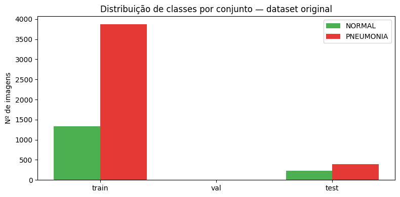
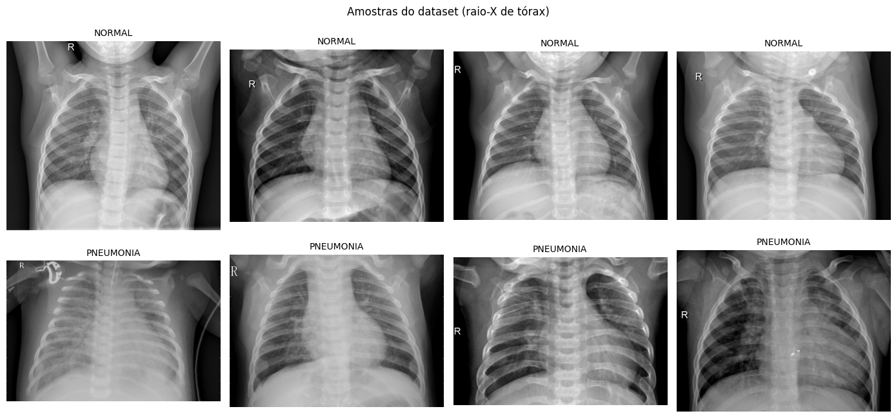
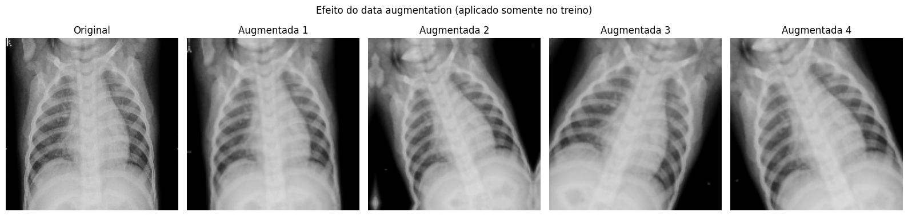

# CardioIA — Fase 4 | Relatório da Parte 1: Pipeline de Pré-processamento

**Equipe:** Alice C. M. Assis (RM566233) · Leonardo S. Souza (RM563928) · Lucas B. Francelino (RM561409) · Pedro L. T. Silva (RM561644) · Vitor A. Bezerra (RM563001)
**Data:** Junho/2026

## 1. Dataset escolhido

Utilizamos o **Chest X-Ray Images (Pneumonia)**, dataset público hospedado no Kaggle (paultimothymooney/chest-xray-pneumonia), contendo 5.856 radiografias de tórax em JPEG, rotuladas em duas classes: **NORMAL** e **PNEUMONIA**. A escolha se justifica por quatro fatores: relevância clínica ao contexto cardiopulmonar do CardioIA; tamanho viável (~2 GB) para treino completo no Google Colab gratuito, ao contrário do NIH Chest X-rays completo (~42 GB); problema binário bem definido, adequado para comparar uma CNN do zero com Transfer Learning; e desbalanceamento real entre classes (~3 casos de pneumonia para cada normal), que reflete um desafio comum em dados de saúde e fundamenta a análise ética da fase.

## 2. Exploração inicial

A inspeção do dataset revelou três pontos que orientaram o pipeline. Primeiro, as imagens possuem **dimensões variadas** (de ~400px a mais de 2000px de largura) e modos de cor inconsistentes (algumas em escala de cinza, outras RGB), exigindo padronização. Segundo, o conjunto de **validação original contém apenas 16 imagens**, quantidade estatisticamente insuficiente para monitorar o treino. Terceiro, o conjunto de treino apresenta **desbalanceamento de aproximadamente 3:1** a favor da classe PNEUMONIA (3.875 vs 1.341 imagens).

*Distribuição das classes nos conjuntos original (note o conjunto `val` degenerado, com apenas 16 imagens, e o desbalanceamento ~3:1 no treino).*

*Exemplos de radiografias de cada classe — opacidades e consolidações caracterizam os casos de PNEUMONIA.*

## 3. Etapas do pipeline e justificativas

**Redimensionamento para 150×150 pixels.** CNNs exigem entrada de dimensão fixa. O tamanho de 150px preserva os padrões pulmonares relevantes (opacidades, consolidações) e mantém o consumo de memória compatível com a GPU T4 gratuita do Colab, permitindo batches de 32 imagens.

**Conversão para tensores RGB (3 canais).** Embora radiografias sejam essencialmente monocromáticas, os modelos pré-treinados usados na Parte 2 (VGG16) esperam entrada de 3 canais, pois foram treinados no ImageNet. Manter RGB unifica o pipeline para as duas abordagens.

**Normalização de pixels para o intervalo [0, 1].** Dividir os valores por 255 estabiliza os gradientes e acelera a convergência do treinamento — valores de entrada em escalas grandes geram atualizações de peso instáveis.

**Divisão treino/validação/teste.** Como a validação original é inutilizável (16 imagens), recriamos a divisão: **80% do treino original para treino e 20% para validação** (com semente fixa, `seed=42`, garantindo reprodutibilidade), mantendo o **conjunto de teste original intacto e nunca utilizado durante o desenvolvimento** — condição necessária para uma avaliação final honesta, sem vazamento de dados.

**Data augmentation (apenas no treino).** Aplicamos rotação (±10%), zoom (±10%) e contraste (±10%) aleatórios para aumentar a diversidade efetiva dos dados e reduzir overfitting. Duas decisões merecem destaque: o augmentation **não é aplicado** à validação nem ao teste, que devem refletir a distribuição real; e o **flip horizontal foi deliberadamente evitado**, pois inverteria a posição anatômica do coração (situs inversus é raríssimo), criando exemplos clinicamente irreais.

*Variações geradas pelo augmentation a partir de uma mesma radiografia (rotação, zoom e contraste).*

**Pesos de classe.** Para mitigar o desbalanceamento 3:1, calculamos `class_weight` inversamente proporcional à frequência de cada classe, fazendo com que erros na classe minoritária (NORMAL) pesem mais na função de perda durante o treino da Parte 2.

## 4. Resumo

| Etapa | Decisão |
|---|---|
| Dataset | Chest X-Ray Pneumonia (Kaggle), 5.856 imagens, 2 classes |
| Redimensionamento | 150×150×3 |
| Normalização | Pixels em [0, 1] (Rescaling 1/255) |
| Splits | Treino 80% / Validação 20% / Teste original intacto |
| Augmentation | Rotação, zoom e contraste ±10% — somente no treino |
| Desbalanceamento | Compensado via `class_weight` |
| Reprodutibilidade | Semente fixa (42) em todas as operações aleatórias |

O pipeline completo está implementado e documentado no notebook `01_preprocessamento.ipynb`, e é consumido sem alterações pelo notebook da Parte 2, garantindo que ambos os modelos (CNN do zero e Transfer Learning) recebam dados idênticos.
