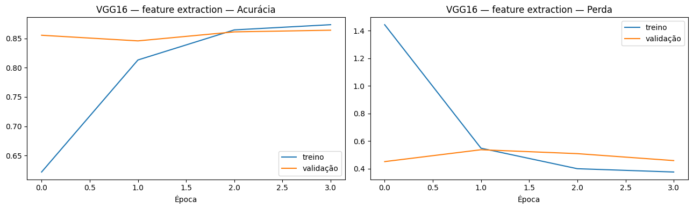
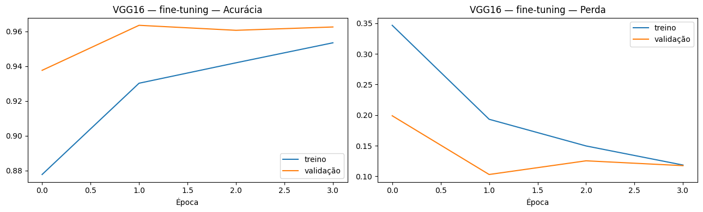
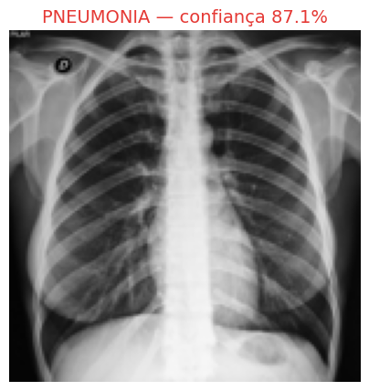

# CardioIA — Fase 4 | Relatório da Parte 2: Classificação com CNN

**Equipe:** Alice C. M. Assis (RM566233) · Leonardo S. Souza (RM563928) · Lucas B. Francelino (RM561409) · Pedro L. T. Silva (RM561644) · Vitor A. Bezerra (RM563001)
**Data:** Junho/2026

## 1. Objetivo

Classificar radiografias de tórax em **NORMAL** vs **PNEUMONIA** a partir dos dados
preparados na Parte 1, comparando duas abordagens exigidas no enunciado: uma **CNN
treinada do zero** e **Transfer Learning com VGG16**. Toda a implementação está em
[`notebooks/02_cnn_transfer_learning.ipynb`](../notebooks/02_cnn_transfer_learning.ipynb),
que reaproveita sem alterações o pipeline de pré-processamento (resize 150×150, RGB,
normalização [0,1], augmentation só no treino e `class_weight` para o desbalanceamento ~3:1).

## 2. Abordagem 1 — CNN treinada do zero

Arquitetura clássica com **4 blocos convolucionais** (Conv2D 32→64→128→128 + MaxPooling),
seguidos de `Flatten`, `Dropout(0.5)`, `Dense(256, relu)` e `Dense(1, sigmoid)` —
totalizando ~2,9 milhões de parâmetros. Treino com `Adam(1e-4)`, `binary_crossentropy`,
`class_weight` e callbacks de `EarlyStopping` (paciência 4, `restore_best_weights`) e
`ReduceLROnPlateau`. As curvas de treino mostram convergência estável, sem overfitting
acentuado (validação acompanha o treino):


## 3. Abordagem 2 — Transfer Learning com VGG16

A **VGG16** pré-treinada no ImageNet é usada em duas fases: (1) **feature extraction** com
a base congelada e um topo novo (`GlobalAveragePooling2D` → `Dropout(0.4)` →
`Dense(256)` → `Dense(1, sigmoid)`); e (2) **fine-tuning** do último bloco convolucional
(`block5`) com taxa de aprendizado 10× menor (`Adam(1e-5)`), preservando os pesos das
camadas iniciais. A entrada passa pelo `preprocess_input` oficial da VGG16.




## 4. Avaliação e métricas (conjunto de teste — 624 imagens)

As métricas foram calculadas com `scikit-learn` (`classification_report`,
`confusion_matrix`) sobre o conjunto de teste original, **nunca utilizado no treino**.

| Modelo | Acurácia | Recall PNEUMONIA | Recall NORMAL | Precisão PNEUMONIA | F1 macro |
|---|---|---|---|---|---|
| CNN do zero | **88,62%** | 98,46% | **72,22%** | 85,52% | **0,8709** |
| Transfer Learning (VGG16) | 80,29% | **98,72%** | 49,57% | 77,54% | 0,7579 |

**Matrizes de confusão:**

| CNN do zero | Transfer Learning (VGG16) |
|---|---|
|  |  |

- **CNN do zero:** 169 NORMAL e 384 PNEUMONIA corretos; 65 falsos positivos e apenas
  6 falsos negativos.
- **VGG16:** 116 NORMAL e 385 PNEUMONIA corretos; 118 falsos positivos e 5 falsos
  negativos.

## 5. Análise comparativa e seleção do modelo

Ambos os modelos atingem **recall de PNEUMONIA acima de 98%** — desejável em triagem, pois
minimiza falsos negativos (pacientes doentes não detectados). A diferença decisiva está na
classe NORMAL: o VGG16 com fine-tuning ficou **sobre-especializado em PNEUMONIA**
(recall NORMAL de apenas 49,57%), gerando muitos falsos positivos, enquanto a **CNN do
zero** manteve melhor equilíbrio (recall NORMAL 72,22%).

Como critério de desempate usamos o **F1 macro**, que pondera as duas classes igualmente:
**0,8709 (CNN) vs 0,7579 (VGG16)**. Portanto, selecionamos a **CNN do zero** como modelo
final — salvo em `modelo_cardioia.keras` e consumido pelos protótipos Flask e mobile:

```python
melhor = modelo_tl if resultado_tl["f1_macro"] >= resultado_cnn["f1_macro"] else cnn
melhor.save("modelo_cardioia.keras")  # -> cnn_do_zero
```

Esse resultado — uma CNN simples superando um modelo pré-treinado robusto — é coerente com
a natureza do dataset: imagens de domínio restrito (raios-X de tórax pediátricos) e bem
padronizadas, em que os filtros de baixo/médio nível aprendidos do zero já capturam os
padrões relevantes, sem necessidade da capacidade genérica do ImageNet.

## 6. Protótipo de apresentação

A própria seção 7 do notebook permite enviar uma imagem e ver a predição com a confiança
(print abaixo). Os mesmos resultados são expostos no app web Flask (`app/`) e no app mobile
React Native (`mobile/`, Ir Além 2).



> ⚠️ Protótipo educacional — não substitui diagnóstico médico. Ver limitações e análise de
> fairness em [`ir_alem1_etica_governanca.md`](ir_alem1_etica_governanca.md).
